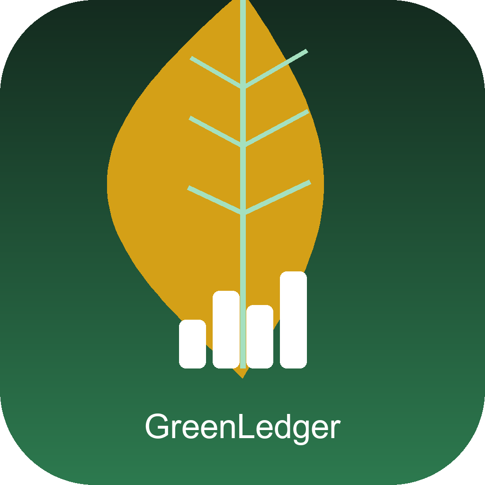

<div align="center">



# GreenLedger

### Sürdürülebilir Finans Platformu

*Çevreci davran, daha ucuza finanse et.*

> 🇹🇷 E-ticaret satıcılarının sürdürülebilirlik skorunu yapay zeka ile analiz eden, yeşil davranışı finansal avantaja dönüştüren fintech platformu.
>
> 🇬🇧 An AI-powered fintech platform that measures e-commerce sellers' sustainability performance and rewards eco-friendly behavior with lower interest rates and higher credit limits.

<br/>


<br/>

> **DATALIM** · Hackathon 2025

</div>

---

## Nedir?

GreenLedger, e-ticaret satıcılarının **sürdürülebilirlik performansını** ölçen ve bunu **finansal avantaja** dönüştüren yapay zeka destekli bir fintech platformudur.

Geleneksel sistemlerde sürdürülebilirlik bir maliyet kalemidir. GreenLedger'da ise çevreci davranan satıcı daha düşük faizle kredi alır, daha yüksek limit kazanır.

```
Eko Ambalaj + Yeşil Lojistik = Düşük Faiz + Yüksek Kredi Limiti
```

---

## Özellikler

### GreenScore Sistemi

Satıcıların çevresel performansını **0–100** arası puanlayan dinamik algoritmamız:

| Kriter | Etki |
|--------|------|
| Eko ambalaj | +15 puan |
| Yeşil lojistik | +20 puan |
| Müşteri memnuniyeti | +0 – +10 puan |
| Mağaza puanı | +0 – +6 puan |
| İade oranı | −1.5× oran |
| Stok devir hızı | +5 puan (< 15 gün) |

**GreenScore → Faiz & Limit:**

| GreenScore | Faiz Oranı | Kredi Çarpanı |
|:----------:|:----------:|:-------------:|
| 90 – 100 | **%0.8** | 0.66× aylık ciro |
| 70 – 89 | %1.2 | 0.58× aylık ciro |
| 50 – 69 | %1.8 | 0.50× aylık ciro |
| 0 – 49 | %2.4 | 0.30× aylık ciro |

---

### AI Danışman — Gemini 2.5 Flash

Satıcı bazlı 5 farklı yapay zeka analizi:

```
📊 GreenScore Analizi   →  Güçlü/zayıf yönler, tahmini skor artışı
💳 Kredi Risk Analizi   →  Risk skoru, karar önerisi, 6 aylık tahmin
🤖 AI Koç               →  Gerçek zamanlı sohbet, pratik tavsiyeler
📄 Aylık Rapor          →  Performans özeti ve aksiyon önerileri
🗺️ 90 Günlük Harita     →  Adım adım sürdürülebilirlik yol haritası
```

---

### Rozet Sistemi

Satıcılar başarılarına göre 8 farklı rozet kazanır:

| Rozet | Koşul |
|-------|-------|
| 🌿 Yeşil Öncü | Eko paket + yeşil kargo |
| 🏅 GreenScore Ustası | Skor ≥ 80 |
| ☁️ Karbon Savaşçısı | CO₂ < 200 kg/ay |
| ❤️ Müşteri Dostu | Memnuniyet ≥ 4.5 |
| ✅ İade Şampiyonu | İade oranı < %3 |
| ♻️ Eko Paket | Çevreci ambalaj kullanımı |
| 🚚 Yeşil Kargo | Düşük karbonlu lojistik |
| ⚡ Hız Ustası | Stok devir < 10 gün |

---

### Diğer Özellikler

- **Dashboard** — Toplam ciro, ortalama GreenScore, karbon ayak izi, kullandırılan kredi özeti
- **Satıcı Yönetimi** — Trendyol, Amazon, Hepsiburada, N11, Etsy platform filtreleri; arama ve sıralama
- **Sıralama Tablosu** — GreenScore / Ciro / Müşteri Memnuniyeti / İade bazlı rekabet
- **Kredi & Faktoring** — Başvuru takibi, tür ve durum bazlı sekmeler
- **PDF Rapor** — Satıcı bazlı detaylı rapor çıktısı
- **Akıllı Bildirimler** — Kredi hazır ve GreenScore milestone uyarıları
- **Hamburger Menü** — Hızlı filtreler (min GreenScore, Eco-only), dil seçimi (TR/EN), yardım & SSS
- **Karanlık / Aydınlık Mod** — Tam Material 3 tema desteği
- **Satıcı / Alıcı Rolü** — Rol bazlı özelleştirilmiş arayüz

---

## Teknik Mimari

```
lib/
├── main.dart                    # Uygulama girişi, navigasyon, hamburger menü
├── models/
│   ├── models.dart              # Seller, CreditApplication veri modelleri
│   └── badge_model.dart         # Rozet sistemi & unvan hesaplama
├── screens/
│   ├── dashboard_screen.dart    # Ana sayfa & metrikler
│   ├── sellers_screen.dart      # Satıcı listesi & filtreler
│   ├── leaderboard_screen.dart  # Sıralama tablosu
│   ├── credits_screen.dart      # Kredi & faktoring
│   ├── ai_advisor_screen.dart   # Gemini AI danışman (5 sekme)
│   ├── portfolio_screen.dart    # Alıcı portföy görünümü
│   └── settings_screen.dart     # Hesap & tercihler
├── services/
│   ├── gemini_service.dart      # Gemini 2.5 Flash API entegrasyonu
│   ├── data_service.dart        # Yerel veri yönetimi
│   ├── notification_service.dart
│   └── pdf_service.dart
├── theme/
│   └── app_theme.dart           # Material 3, dark/light tema sistemi
└── widgets/
    ├── common_widgets.dart
    └── help_sheet.dart
```

### Teknoloji Yığını

| Kategori | Teknoloji |
|----------|-----------|
| Framework | Flutter 3.0+ (Dart) |
| State Management | Provider |
| Yapay Zeka | Google Gemini 2.5 Flash |
| Grafikler | fl_chart |
| Tipografi | Google Fonts — Space Grotesk |
| Animasyon | flutter_animate, shimmer |
| Depolama | shared_preferences |
| Raporlama | pdf, printing |
| Bildirimler | flutter_local_notifications |
| Yardımcı | intl, uuid, http |

---

## Kurulum

### Gereksinimler

- Flutter SDK `≥ 3.0.0`
- Android SDK — min API 21 (Android 5.0)
- Google Gemini API anahtarı → [aistudio.google.com](https://aistudio.google.com)

### Adımlar

```bash
# Repoyu klonla
git clone https://github.com/DATALIM/greenledger.git
cd greenledger

# Bağımlılıkları yükle
flutter pub get

# API anahtarını gir
# lib/services/gemini_service.dart → _apiKey alanını doldur

# Uygulamayı çalıştır
flutter run

# Release APK oluştur
flutter build apk --split-per-abi --release
```

### APK

| Mimari | Dosya | Hedef Cihaz |
|--------|-------|-------------|
| arm64-v8a | `app-arm64-v8a-release.apk` | Modern Android — **önerilir** |
| armeabi-v7a | `app-armeabi-v7a-release.apk` | Eski Android cihazlar |
| x86_64 | `app-x86_64-release.apk` | Emülatör |

> Releases sekmesinden direkt APK indirilebilir.

---

## Neden GreenLedger?

Türkiye'de e-ticaret hacmi her yıl büyürken çevresel etki de artmaktadır. Mevcut kredi sistemleri yalnızca finansal verilere bakar; sürdürülebilirlik hiçbir zaman bir finansal avantaja dönüşmez.

GreenLedger bu boşluğu kapatır:

- Satıcı çevreci adım atar → GreenScore yükselir
- GreenScore yükseldikçe → Faiz oranı düşer, kredi limiti artar
- Finansal teşvik → Daha fazla satıcı yeşil dönüşüme geçer

**Sonuç:** Hem satıcı kazanır, hem çevre.

---

## Takım

<div align="center">

### DATALIM

| | İsim |
|:-:|------|
| 👤 | Muhammed Ali Uzun |
| 👤 | Bahar Direk |
| 👤 | Abdullah Alagöz |

</div>

---

<div align="center">

MIT © 2025 DATALIM

*GreenLedger — Yeşil finansın geleceği*

</div>
